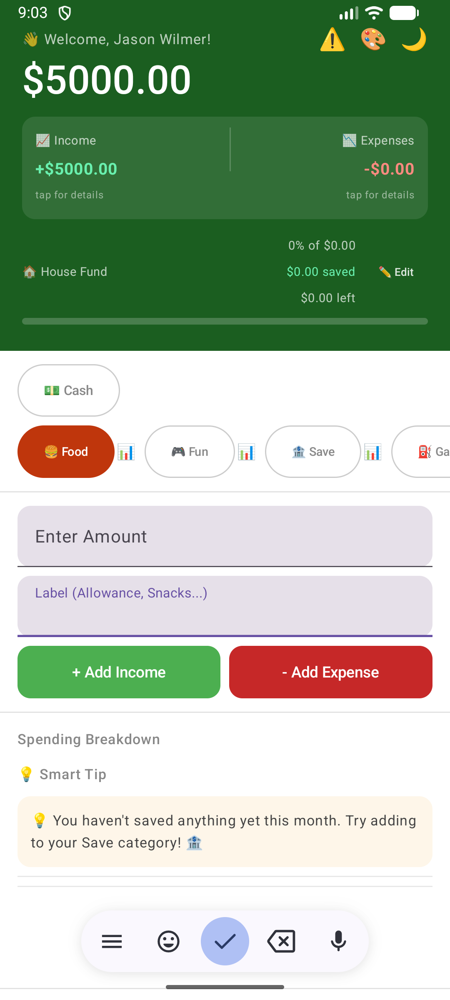

# 🐷 PiggyBank Pro

### A Personal Finance Android App for All Ages

---

## 📱 About

PiggyBank Pro is a full featured personal finance Android app designed for users of all ages — from children saving their allowance to senior citizens managing retirement budgets. Built entirely with Kotlin and Jetpack Compose as a capstone project at Southwest Technical College.

---

## ✨ Features

### 💰 Core Finance
- Track income and expenses in real time
- Live balance with animated updates
- 10 color coded scrollable expense categories
- Delete transactions with automatic balance adjustment
- Share transaction summary via email or text

### 📊 Charts & Analytics
- Professional donut pie chart showing spending breakdown
- Tappable income and expense charts with bar and line graphs
- 1 month, 3 month and 6 month time period selector
- Category history with bank statement style view
- Smart spending tips based on your habits
- Monthly best and worst spending summary

### 🏦 Savings Goals
- Set custom savings goals with dollar amount
- Choose from 10 savings icons — house, car, vacation, college and more
- Animated progress bar showing percentage complete
- Confetti celebration when goal is reached
- Option to start a new goal or keep going after reaching target

### 🔐 Security
- 4 digit PIN protection on app launch
- PIN setup with confirm step
- Choose 4 security questions from 13 options
- Random security question picker for PIN reset
- Encrypted data storage

### 🎨 Personalization
- Welcome message with your name
- Dark mode toggle
- 8 color themes — Forest, Ocean, Sunset, Purple, Teal, Gold, Rose, Slate
- Low balance warning with flashing red header alert
- Custom piggy bank app icon

### 📅 Transaction Details
- Date stamp on every transaction
- Category based transaction history
- Income and expense breakdown charts
- Smart financial tips updated automatically

---

## 🛠️ Built With

| Technology | Purpose |
|-----------|---------|
| Kotlin | Primary programming language |
| Jetpack Compose | Modern UI toolkit |
| ViewModel | State management and screen rotation |
| SharedPreferences | Persistent data storage |
| Canvas API | Custom pie charts and graphs |
| Coroutines | Async animations and effects |
| Material Design 3 | UI components and theming |
| Android Studio | Development environment |

---

## 📸 Screenshots

| Dashboard | Dark Mode |
|-----------|-----------|
|  |  |

| PIN Screen | Lockout Screen |
|------------|-----------------|
|  |  |

---

## 🚀 Getting Started

### Prerequisites
- Android Studio Hedgehog or newer
- Android SDK 24 or higher
- Kotlin 1.9 or higher

### Installation
1. Clone the repository
